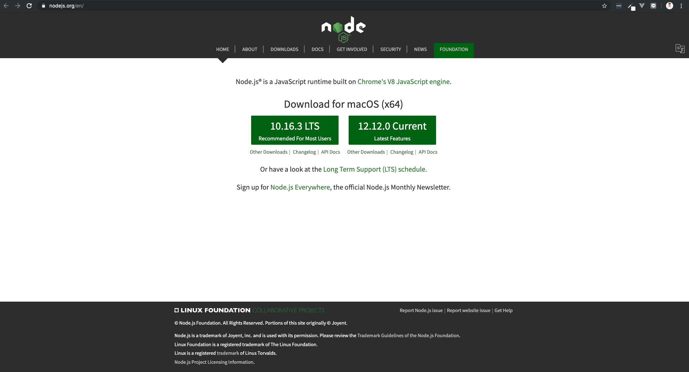
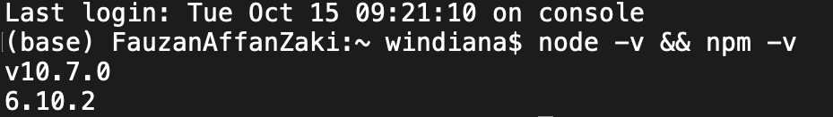
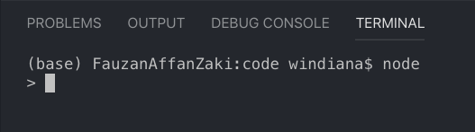
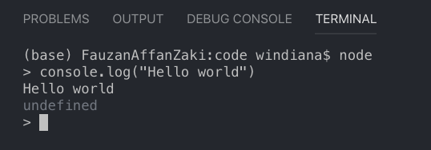

# Node js

Node js adalah ***runtime* javascript yang dibangun di mesin [*javascript V8 Chrome*](https://v8.dev/) untuk memudahkan pembuatan aplikasi jaringan cepat dan memungkinkan perusahaan untuk beradaptasi dengan beban kerja yang lebih tinggi tanpa harus mengorbankan performa atau keuntungan lainya (skalabel) di sisi *server***. Sama dengan peran bahasa pemrograman seperti php, node dapat digunakan untuk memproses konten dan transaksi dinamis yang dikirimkan ke *server* oleh *browser*, aplikasi *mobile*, dsb. Perlu di ketahui, **node bukanlah bahasa pemrograman, melainkan *runtime environment* untuk mengeksekusi kode bahasa pemrograman javascript di sisi server *(server-side)*.**

Beberapa *website* seperti Trello, Paypal, Netflix, Linkedin, Medium, Uber telah menggunakan Node sebagai aplikasi *web server*-nya.

Node menggunakan prinsip ***non-bloking I/O* yang artinya tidak menunggu sampai sebuah *request* selesai terlebih dahulu untuk menangani *request* berikutnya**, hal ini membuat node dapat menerima relatif lebih banyak *request* dan lebih cepat dari pada teknologi *web server* lainnya. Oleh karena itu, node mudah untuk diperbesar kapasitas pemrosesan datanya atau biasa disebut *scale-up*.

Node juga cocok digunakan untuk membangun aplikasi *realtime* seperti aplikasi chat, IOT, dsb. Node memiliki *library* yang cukup lengkap dan komunitas yang besar. Node ini sangat cocok digunakan untuk membangun API berbasis REST (REST API akan dibahas pada *course* berikutnya) yang dapat dikonsumsi oleh berbagai aplikasi lainnya.

Sama seperti bahasa pemrograman php yang memiliki banyak *framework* yang dapat digunakan seperti Laravel, Codeigniter, dsb. Node juga memiliki *framework*, salah satu yang cukup populer yaitu ***Express js*** (*Express js* akan dibahas pada *chapter* berikutnya).

## Instalasi Node js

Untuk menginstal node js silahkan ikuti *step by step* berikut ini:

1. *Download* node js di *website* resminya [nodejs.org](https://nodejs.org/en/)

    

2. Kemudian *install* seperti menginstal aplikasi pada umumnya hingga selesai.

3. Untuk melihat apakah node terinstal di komputer, silahkan buka terminal atau *Command Line / Command Prompt*. Cek versi node dan npm kita:

    ```terminal
    node -v && npm -v
    ```

    Maka akan terlihat hasilnya sebagai berikut:

    

    `v10.7.0` akan mengikuti versi node di komputer kita. `6.10.2` akan mengikuti versi npm di komputer kita.

## Hello World

Kita kenalan dulu dengan REPL *(Read Evaluate Print Loop)*, yaitu aplikasi yang berbasis terminal *(command promt)* di mana kita bisa mengetikkan kode secara langsung dan mendapatkan hasilnya secara langsung. Langsung saja buka terminal dan ketikkan `node` lalu tekan enter, tampilannya akan seperti berikut:



Untuk membuat *hello world* kita tinggal membungkus tulisan *hello world* dengan perintah `console.log()` sebagai berikut:



Jika kita lihat gambar di atas, tulisan `Hello world` berada tepat di bawah `console.log("Hello world")`.
