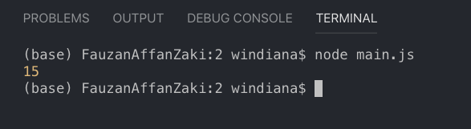

# Modules

Apa itu *module?* Pada dasarnya *module* sama dengan *javascript library*. *Module* berisi kompulan fungsi-fungsi yang mau kita pakai di dalam aplikasi kita. Agar lebih rapih, fungsi-fungsi tersebut disatukan ke dalam *file* tertentu, yang dinamakan *module*.

## Built-in Modules

Node js mepunyai *module-module* yang sudah otomatis terinstal ketika kita pertama kali menginstal node js. *Module-module* tersebut dinamakan *built-in modules.*

## Menambahkan Module

Untuk memasukkan *module* cukup dengan menggunakan perintah `require()` dengan nama *module* sebagai parameternya. Kita panggil *module* bawaan node js yaitu `http` seperti berikut:

```js
const http = require('http');
```

Setelah kita panggil *module* `http`, kita bisa menggunakan *module* `http` tersebut, lalu kita bisa membuat *server*:

```js
// membuat server baru menggunakan fungsi createServer yang terdapat di http
http.createServer((req,res) => {

    // menuliskan hello world di browser
    res.write("Hello world");

    // mengakhiri response
    res.end();
}).listen(8000); // mengatur port 8000
```

## Membuat Module

Kita bisa membuat *module* kita sendiri dan memasukkannya ke dalam aplikasi yang sedang kita buat. Contoh, kita mau membuat satu *module* yang berisi penjumlahan a dan b seperti ini:

```js
// membuat fungsi dengan nama tambah
exports.tambah = function (a,b) {
    return a + b;
}
```

`exports` digunakan agar properti dan fungsi kita bisa digunakan di luar *module* ini. `tambah` adalah nama fungsi di *module* ini. Propertinya adalah `a` dan `b`. *Save module* di atas dengan nama `penambahan.js`.

## Menambahkan Module penambahan.js

Nah, sekarang kita bisa memasukkan atau meng-*include* *module* yang telah kita buat barusan di semua *file* node js yang kita punya. Caranya sebagai berikut:

```js
// include module penambahan.js
const modul = require('./penambahan');

// tampung ke dalam hasil
let hasil = modul.tambah(10,5); // tambah adalah nama fungsi yang terdapat di module penambahan.js

// tampilkan
console.log(hasil);
```

*Save module* di atas dengan nama `main.js`.

Jangan lupa gunakan `./` untuk memanggil *module*, yang artinya *module* `penambahan.js` tersimpan di satu *folder* yang sama dengan *file* node js kita, yaitu `main.js`.

Kemudian jalankan di terminal dengan perintah:

```terminal
node main.js
```

Jika mengikuti langkah-langkah di atas, kita akan melihat hasil dari *module* yang telah kita buat, yaitu `15` seperti berikut:


