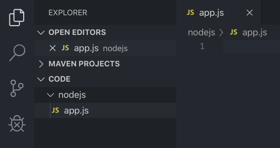
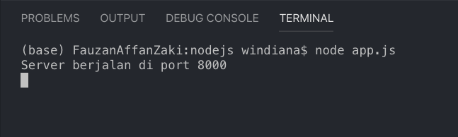
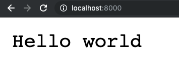

# HTTP Server 1

## Hello Wolrd via server

Untuk membuat *server* pada *node js*, dapat menggunakan *module* atau *library* dengan nama *http*.

*Module* *http* ini akan secara otomatis terinstal begitu kita menginstal node js. Untuk menggunakannya, maka kita harus memanggilnya dengan fungsi `require()`.

Mari kita mulai dengan menampilkan `hello world` di *browser* menggunakan *server* kita.

1. Kita mulai proyek node js kita dengan membuat sebuah direktori atau folder baru dengan nama `nodejs` menggunakan terminal, yang nantinya berisi *source code* node js kita:

    ```js
    mkdir nodejs
    ```

    Setelah kita membuat direktori, masuk ke direktori yang telah dibuat tadi:

     ```js
    cd nodejs/
    ```

    Jika teman-teman belum *familiar* dengan *console* terminal, kita bisa juga menggunakan *text editor*.

    Pertama, buat sebuah *file* javascript dengan nama `app.js` di dalam direktori `nodejs`. Kemudian buka dengan *text editor*. Di sini saya menggunakan [vscode](https://code.visualstudio.com/) dengan tambahan *extension* [ESLint](https://marketplace.visualstudio.com/items?itemName=dbaeumer.vscode-eslint) dan [JavaScript (ES6) code snippets](https://marketplace.visualstudio.com/items?itemName=xabikos.JavaScriptSnippets). Seperti gambar berikut:

    

    Urutan direktori yang saya buka di vscode adalah code > nodejs > app.js. Teman-teman bisa membuat *folder* `nodejs` dan *file* `app.js` nya saja.

2. Kemudian ketikan kode berikut di dalam *file* `app.js`:

    ```js
    // menggunakan module http
    const http = require('http');

    // membuat server baru menggunakan fungsi createServer yang terdapat di http
    http.createServer((req,res) => {

        // menuliskan hello world di browser
        res.write("Hello world");

        // mengakhiri response
        res.end();
    }).listen(8000); // mengatur port 8000

    // memberitahukan server kita sedang berjalan
    console.log("Server berjalan di port 8000");
    ```

3. Buka terminal di vscode dan jalankan *file* `app.js` dengan mengetikkan perintah:

    ```terminal
    node app.js
    ```

    Pastikan *path*-nya berada pada *folder* `nodejs`. Jika berhasil tampilan terminalnya seperti ini:

    

4. Buka *browser* dan masukkan url `localhost:8000`. Browser akan menampilkan tulisan `Hello world` seperti berikut:

    

5. Untuk menghentikan *server* yang sedang berjalan, kita tinggal menekan `control + c` di terminal.
