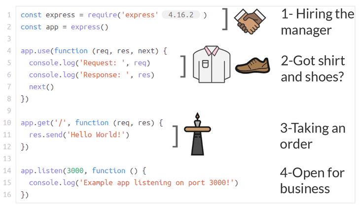

# Pengenalan Express

**Kalau kita pernah masuk dan duduk di suatu restoran, harusnya kita sudah mengerti *basic express*.**

Jika kita mencoba membuat node js *(back-end)* untuk pertama kalinya, mungkin kita akan menemui sedikit kesulitan. Kenapa? Karena akan lebih mudah untuk kita belajar node jika kita sudah berpengalaman dengan javascript. Dan tantangan yang akan kita hadapi saat membangun *back-end* sama sekali berbeda dari yang kita hadapi saat menggunakan javascript di *front-end*.

Ada cara mudah untuk membangun *back-end* kita menggunakan javascript. Kita akan menggunakan analogi restoran untuk **menjelaskan 4 bagian penting dari aplikasi express pertama kita**. Tenang saja, [express.js](https://expressjs.com/) adalah *framework* yang terkenal untuk mengorganisir kode kita, dan sangat direkomendasikan untuk para pemula.

Ada 4 bagian penting yang akan kita bahas:

1. *The require statements*
2. *Middleware*
3. *Routing*
4. `App.listen()` atau memulai *server*

Di analogi ini, kita adalah pemilik restoran yang sedang ingin merekrut *general manager*. *General manager* adalah orang yang akan membuat semua proses dan mengelola tempat restoran, sehingga semua berjalan lancar dan pelanggan senang.

Ini adalah persamaan kode di dalam *express* dengan apa yang akan kita lakukan selanjutnya:



Yang kita lakukan adalah:

1. Merekrut *general manager* a.k.a *express*
2. Selanjutnya kita selaku pemilik restoran menjelaskan ke pada *manager*, bagaimana caranya mengecek apakah pelanggan yang datang menggunakan kemeja? atau menggunakan sepatu? Atau menggunakan ke duanya?
3. Sejauh ini *manager* hanya tau bagaimana membedakan pelanggan berdasarkan kemeja dan sepatu. Tapi *manager* ga tau gimana caranya mengarahkan pelanggan ke meja dan mempersilahkannya duduk. Nah, pada tahap ke tiga ini kita menjelaskan kepada *manager* cara mengatur ke tabel mana pelanggan tersebut duduk.
4. Sejauh ini, harusnya kita sudah menyewa seorang *manager*, lalu menentukan apa yang harus dilakukan sebelum menerima permintaan pelanggan, dan menentukan apa yang harus dilakukan dengan permintaan pelanggan tertentu begitu mereka masuk. Pada tahap terakhir ini, kita hanya perlu menentukan alamat untuk lokasi restoran kita, di mana semua ini akan terjadi.

## Menjalankan kode

Kode aslinya sebagai berikut:

```js
const express = require('express')
const app = express()

app.use(function (req,res,next) {
    console.log('Request :', req)
    console.log('Response :', res)
    next()
})

app.get('/',function (req,res) {
    res.send('Hello World!')
})

app.listen(3000,function () {
    console.log('Contoh server berjalan di port 3000!')
})
```

Jika kita ingin menjalankan kode di atas, simpan kode dengan nama `app.js`. Pastikan kita sudah menginstall `npm`, dan menginstal *express* menggunakan `npm` seperti berikut:

```js
npm install express
```

Jika sudah dijalankan akan muncul satu folder baru dengan nama **node_modules** dan satu *file* baru **package-lock.json**. Selanjutnya jalankan *file* `app.js` dengan menggunakan node:

```js
node app.js
```

Jika berhasil akan muncul tulisan **Contoh server berjalan di port 3000!** di *console*, setelah itu buka *browser* dan ketikan `http://localhost:3000/`. Kita akan melihat tulisan **hello world!** di sana.
