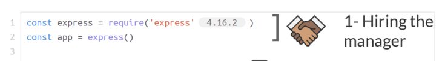
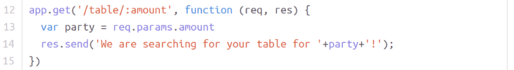
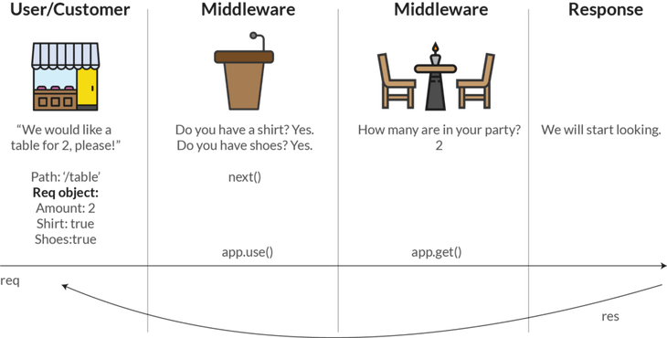

# Routes

## Merekrut General Manager a.k.a Express

Sebelum kita berkenalan dengan *routing*. Pastikan kita merekrut si *general manager* terlebih dahulu.



Seperti semua `npm` *package*, kita membutuhkan baris yang ini:

```js
const app = express();
```

Baris di atas digunakan karena kita membutuhkan variabel untuk menyimpan *express*. *Express* bukan *package* bawaan yang otomatis terinstal ketika kita menginstal node.

## Mengatur Routing

Awalnya, *manager* tidak tau gimana caranya mengarahkan pelanggan ke meja dan mempersilahkannya duduk.

Di sinilah peran *routing*. ***Routing* memungkinkan kita membuat kode untuk tindakan spesifik** berdasarkan ***path***. Contoh *path*:



**Pada baris 12**, kita mendefinisikan bagaimana caranya untuk menemukan tabel menggunakan `app.get()` ketika tamu me-***request*** dengan menggunakan ***routing*** yang mengarah pada ***path*** `/table`.

Setelah `/table` kita juga menambahkan `/:amount` yang nantinya akan diisikan dengan **jumlah pelanggan yang masuk ke dalam restoran** kita.

Diikuti dengan *function* dengan parameter yang dapat melakukan ***request*** dan ***response***.

**Pada baris 13**, kita mengambil jumlah orang dari parameter objek ***request***. Kita tidak bisa melihat isinya berapa orang, karena kita tidak mempunyai *front-end*. Yang perlu kita tau hanyalah `/:amount` yang nantinya akan diisikan dengan **jumlah pelanggan yang masuk ke dalam restoran** dan cara mengambil `/:amount` tersebut menggunakan `req.params.amount`. Jadi jika `/:amount` diisi `/2`, hasilnya akan terbaca seperti ini di *front-end*:

```js
req = {
  params: {
    amount: 2;
  }
}
```

**Pada baris 14**, kita mengirim ***response*** kembali ke pelanggan berupa *text*: ***we are searching for your table for + party + !***. `party` akan berubah menjadi `2` dalam kasus kali ini, karena ***amount***-nya adalah 2.

Lebih jelasnya sebagai berikut:



## Membuat Router

a

## Routing Option

Selain `GET` opsi lainnya untuk *routing* adalah `POST`, `PUT`, dan `DELETE`. Tapi kita akan **fokus pada `GET` dan `POST`** dulu.

Dalam konteks restoran, kita perlu membuat permintaan `GET` untuk memilih meja tertentu dan tempat duduk para pelanggan. `GET` tidak mengubah atau menambah ke kita punya *database*. Tetapi **`GET` hanya mengambil informasi berdasarkan parameter tertentu.**

Sedangkan `POST`, biasanya digunakan untuk **menangani informasi yang dikiramkan oleh `form` di html ke dalam *express***. Nanti akan kita bahas lebih detail tentang `POST`.
