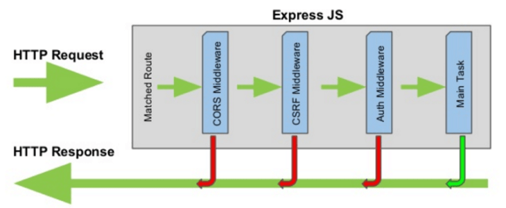
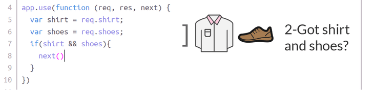
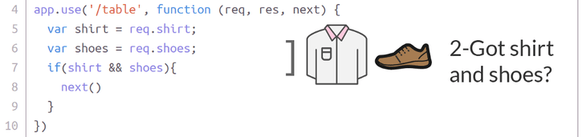
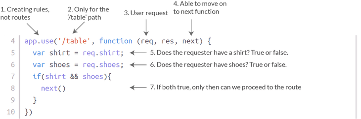

# MiddleWare

## Membuat Keputusan di Restoran

Apa yang biasanya dilakukan di restoran? Setidaknya ada 3 hal yang perlu kita fikirkan, yaitu:

1. Menentukan di mana pelanggan duduk
2. Menerima pesanan makanan
3. Memeberikan struk, bill atau bon ketika pelanggan selesai makan

Untuk setiap *point* di atas, ada beberapa tahapan yang harus kita lakukan untuk mendapatkan hasil seperti ke tiga *point* di atas. Sebagai contoh sebelum kita **menentukan di mana pelanggan duduk**, kita butuh tau:

1. Apakah pelanggan **menggunakan kemeja dan sepatu**? Jika tidak, pelanggan tidak dipersilahkan duduk.
2. Jika pelanggan mau duduk di ***bar***, pelanggan harus berusia minimal 21 tahun.

***Bar*** di restoran kita bukan *bar* yang boleh dimasuki oleh pelanggan di bawah umur. Sama seperti kode yang akan kita buat, kita perlu memvalidasi apakah pelanggan memenuhi kriteria sebelum melanjutkan ke tahap berikutnya. Sebagai contoh, ketika pelanggan mencoba ***login*** ke dalam *website*:

1. Apakah pelanggan mempunyai akun?
2. Apakah pelanggan memasukkan *password* yang benar?

Di sinilah konsep ***middleware*** berperan. Fungsi ***middleware*** memperbolehkan kita untuk memanipulasi ***request*** yang masuk sebelum dikirim kembali menggunakan ***response***.

Di dalam restoran, kita membutuhkan beberapa **aturan** untuk menentukan di mana pelanggan duduk. Contoh misalkan ada **pasangan** datang ke restoran. Kita mempunyai **satu aturan sebelum mempersilahkan mereka duduk**, yaitu:

**1. Apakah mereka menggunakan kemeja dan sepatu?**

Kodenya sebagai berikut:

Pertama, kita mulai dengan `app.use()`. Ini berarti bahwa kita **membuat aturan baru** yang perlu diterapkan untuk ***routes*** yang akan datang berikutnya. Ingat `USE`, bukan `GET`, `POST`, `PUT`, atau `DELETE`.

> Kita sudah membahas ***routes*** pada ***lesson 2***

**Pada baris ke 4**, kita menggunakan *anonymous function* (fungsi tanpa nama) dengan parameter ***req, res,*** dan ***next***. Untuk tujuan pembelajaran, pada kode di atas kita hanya menggunakan ***req*** untuk melihat apakah pelanggan menggunakan kemeja dan sepatu.

Kita juga membutuhkan fungsi ***next()*** untuk melanjutkan ke fungsi berikutnya. Pada *middleware* ini, kita memvalidasi pakaian pelanggan. Nanti di bagian *routes*-nya, kita akan mengarahkan pelanggan ke mejanya.

**Pada baris ke 5 dan ke 6**, kita cek apakah pelanggan menggunakan kemeja dan sepatu.

Dan **pada baris 7 - 9**, kita memproses pelanggang hanya jika pelanggan memiliki kemeja dan sepatu.

## Spesifik Path yang Dimasukkan Bersamaan dengan Request

Kode di atas kehilngan bagian yang penting, yaitu ***path***. ***Path*** adalah **spesifik *string* yang dimasukkan bersamaan dengan *request*.** Jika kita tidak menggunakan ***path***, maka kita akan menjalankan kode di setiap ***request middleware*** yang juga tidak memiliki ***path***.

Bayangkan, ketika pelanggan memasuki restoran, memesan makanan, dan meminta *bill*, karyawan restoran akan memaksa pelanggan untuk diperhatikan dari atas ke bawah, untuk memastikan mereka berpakaian! *That is a quick way to go out of business.*

Untuk itu kita ganti baris ke 4 seperti contoh di atas. Sekarang, kita hanya menjalankan *middleware* kita ketika *user* *request* *route* dengan *path* `/table`.

Lebih jelasnya sebagai berikut:

